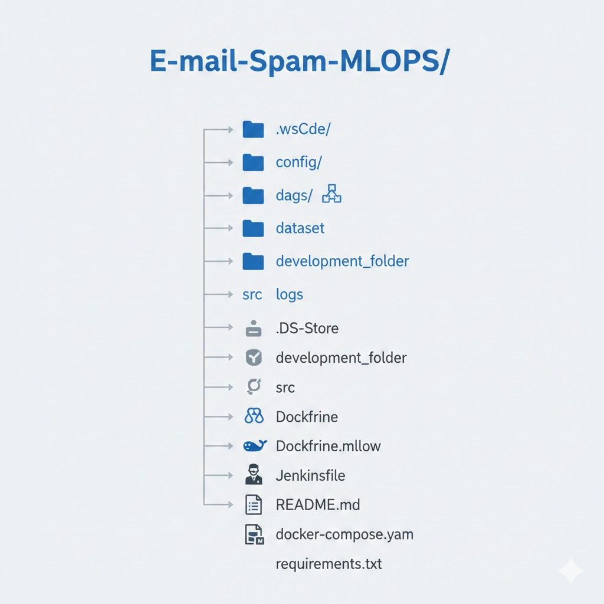

# E-mail-Spam-MLOPS (2weeks)

This is my 3rd MLOPs project. I am taking ref from my 2nd one (https://github.com/ris2002/Sentiment-Analysis-MLOPS.git). In the second one I have done the mlops using zenml, traning has been done using Logistic Regression and deployment has been done using Fast api.

What improvements and what learning I am going to do over the 2nd one in this current project –

* Usage of Airflow  
* Using kubernetes  
(Learning of Basic topics like -
What is Kubernetes
K8s Architecture (high-level)
Main Components (Pod, Deployment, Service, etc.)
Minikube + Kubectl setup
Main kubectl commands
YAML Configuration File) and implementaton
* Zenml had inbuilt mlflow so I am going to use mlflow seperately  
* Learning and using 4 boosting classification models –  
  1] AdaBoost  
  2] Gradient Boosting  
  3] XGB  
  4] Cat Boosting  
* I am going to run more tha one models in same pipeline  

And this will be the another revison of how mlops works

---

## Errors encountered while setting and runing up AirFlow

1] Module not found error – Had a hard time figuring out how to import a function from another folder to thhe dags folder  

A] While creating airflow we need to follow the following steps  

* `curl -LfO 'https://airflow.apache.org/docs/apache-airflow/stable/docker-compose.yaml'`  
  The above command creates a docker-compose yaml file  

* `mkdir -p ./dags ./logs ./plugins`  
  The above folder creates the our wantd main files  

* `docker compose up airflow-init`  
  This initiates the airflow db  

* `docker compose up`  
  This command runs airflow in the docker  

It is convinet to create all the required folders in `mkdir -p ./dags ./logs ./plugins` as the python paths and thhe mounting of those folders would be already be automatically be done in docker-compose yaml file. If you need to use a script from an unmounted folder, first go to docker-compose yaml file, go to volumes path and place the  
**`- ${AIRFLOW_PROJ_DIR:-.}/'folder_name':/opt/airflow/'folder_name':z`**  
then go to environments path and place cmd  
**`PYTHONPATH: /opt/airflow/'folder_name'`**  

This has to be done so that the docker can identify the path of the unmounted folder.  

**(It is important to note that since we have mounted the folders the root folder for all python scripts remain the same irrespective of which folders they are present locally so if you want to import a func directly write `'from script_name import function'` instead of directly writig the local path of it )**

* When defining an Apache Airflow pipeline using @dag and @task decorators, a common issue arises when tasks (imported Python functions) fail to execute in the intended sequential order. The root cause is attempting to rely on the natural top-down flow of Python function calls within the DAG definition, rather than explicitly defining the task dependencies that the Airflow scheduler requires. The solution involves capturing the result of each @task call as a task instance variable and using the functional API's bitshift operator (>>) to build a directed graph (e.g., task_a >> task_b >> task_c), thus explicitly instructing Airflow on the required execution sequence and ensuring reliable pipeline orchestration
---

## Some more errors encoutered while using Airflow

### * Unpacking XComArgs outside tasks

**Scenario:**  
df = ingest_data(csv_path) # returns XComArg
X_Train, X_Test, Y_Train, Y_Test = vectorized_and_split_data(df) # ❌

**Error:**  
`TypeError: 'XComArg' object is not iterable`

**Cause:**  
`@task` decorated functions return XComArg references, not the actual data.  
You cannot unpack or iterate over an XComArg in the DAG definition.

**Fix:**  
Wrap multiple outputs in a dict or tuple inside the task.  
Access via `split["X_Train"]` or `split[0]` in downstream tasks.

---

### * Returning objects not serializable by XCom

**Scenario:**
**Error:**  
`TypeError: 'XComArg' object is not iterable`

**Cause:**  
`@task` decorated functions return XComArg references, not the actual data.  
You cannot unpack or iterate over an XComArg in the DAG definition.

**Fix:**  
Wrap multiple outputs in a dict or tuple inside the task.  
Access via `split["X_Train"]` or `split[0]` in downstream tasks.

---

### * Returning objects not serializable by XCom

**Scenario:**
def vectorized_and_split_data(df):
X_Train, X_Test, Y_Train, Y_Test = processor.vectorize_train_and_split(df)
return X_Train, X_Test, Y_Train, Y_Test

`X_Train` and `X_Test` are scipy sparse matrices.

**Error:**  
`TypeError: cannot serialize object of type <class 'scipy.sparse._csr.csr_matrix'>`

**Cause:**  
Airflow tries to push the returned object to XCom.  
XCom cannot serialize large objects like sparse matrices, big DataFrames, or ML models.

**Fix:**  
Do not return large objects via XCom.  
Save them to disk or cloud storage and return only file paths in XCom.

---

### * I have used a task in my dag which contains other tasks  
what happened is I am not able to track the other tasks within that task

---

### * Var when given in dag fuction gets converted to Xcom  
Better to import the dataset inside the dag funnc instead of giving the dataset instead of declaring it as a var in dag func.

---

### * It is important to note that I was able to run the dag with installing requirements.txt from docker as basic modules like sklearn, pandas and numpy are already pre installed in the airflow so when I ran dag previously I didnot need to installl them. However I faced error whhen I started using mlflow. So the safe thing I thought was use thee docker to innstall all requirements.txt ffile.  
There are also some changes sto be done in thhe docker compose file, in `x-airflow-common:` section I need to comment out the image and un comment out the `build: .` after that build the dockerfile.airflow file and restart it. For mlflow I need to create a seperate docker file Docker.mlflow bothe should be seperate. I have taken ref from (https://medium.com/@dast04/running-airflow-with-docker-compose-2023-for-machine-learning-a78eeadc00cd) 

---

## Project Structure (Need To Complete)

---
## Dag Structure

ingest_data(csv_path)->vectorized_and_split_data(df)->model_training()->evaluate_model()

## Kubernetes Points
* Start minikube using the command 'minikube start --vm-driver==hypertext' here hyper text is the contaieer engine,can use docker also.
* kubectl get nodes and minikube status we chk the staus of minikube
* In K8s pod is the smallest layer but in practice we are creating 'deployment'(the abstration layer or wrapper over pods) It has blue print for creating pods. a replica set will be automatically get no need to manage it as minikube will automatically take care of it based on on how your doing your main pod.
* For the above the cmds are-
kubectl create deployment NAME --image=image [--dry-run][options]/minikube kubectl -- apply -f email-spam-app.yaml
kubectl get pod
kubectl get replicaset
* Deplyment ment manages the replicaset, replicaset manages pod ,pod is abstraction of cconatiner.Everything below deployment is manages automatically by minikube
* to get the config file the cmd is kubectl edit deployment nginx-depl (we get autogenerated config file ) and we can edit the config file.
* kubectl logs PODNAME (give the application logs which is running inside kubectl)
* kubectl delete deployment podname (to delete the pod)
* create or edit config file
vim nginx-deployment.yaml
* The errors I have faced is that I was unable to find the loc of the docker file .So I understood to push the image to remote repo and do it
kubectl apply -f nginx-deployment.yaml
# docker run -d -p 8000:8000 --name email_spam_container email_spam_app:latest .c 
# docker run -d -p 8000:8000 --name email_spam_container email_spam_app:latest

## What I have learnt-
* Airflow structure working 
* Integration of airflow with mlflow
* Boosting models
* The module versions should be same in traing and deployment sencario

